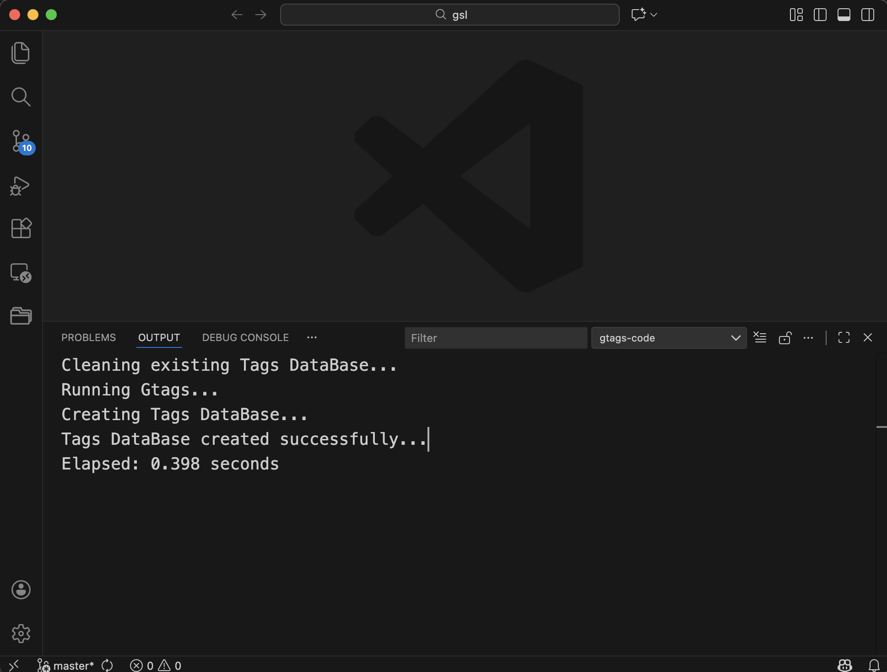
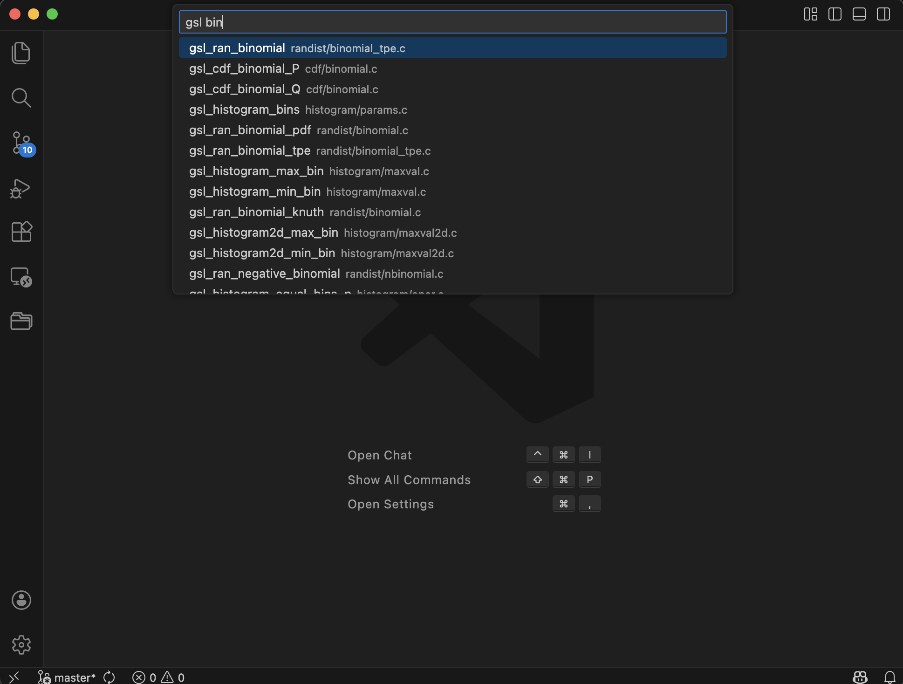
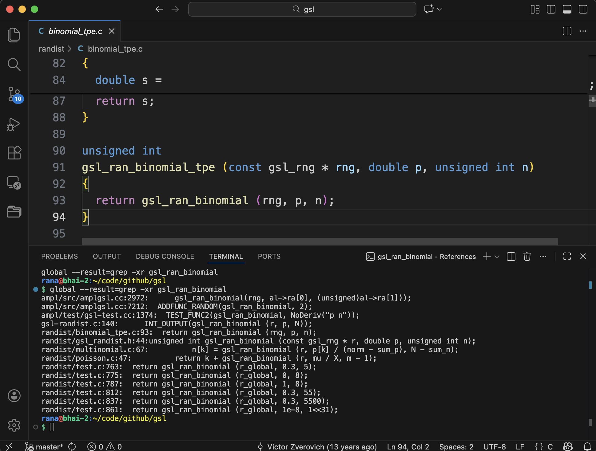
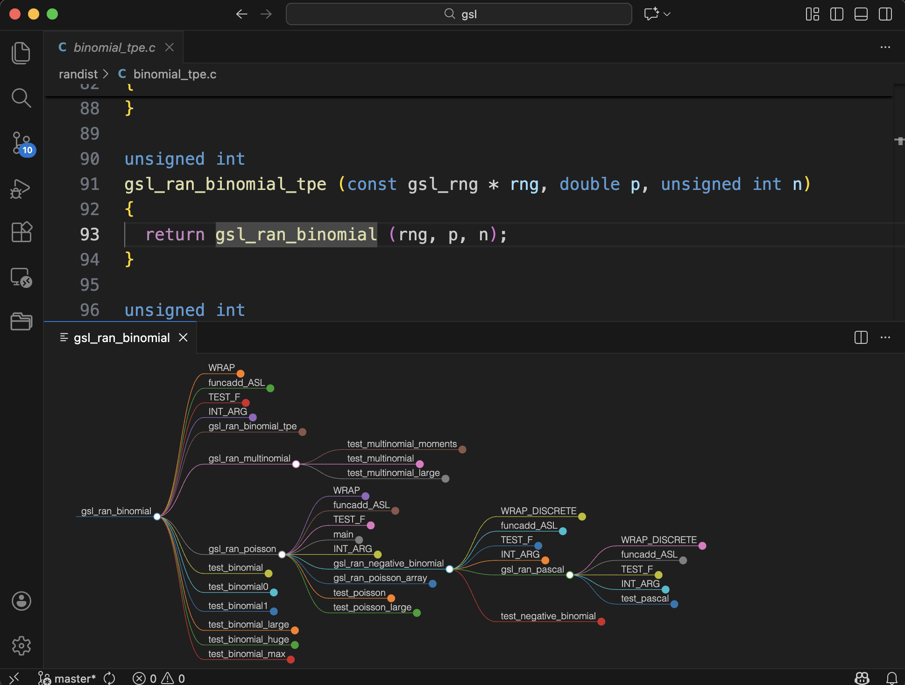

# gtags-code

A Visual Studio Code extension that integrates **Gtags** to provide fast and accurate code navigation across multiple languages.

## Features

- Jump to symbol definitions using GNU Global
- Fast and scalable tag lookups powered by LevelDB
- Quick symbol search via VSCode's Quick Pick UI
- Supports many programming languages through Gtags
- Graphical function call graph visualization using D3.js
- Lightweight and configurable

## Requirements

GNU global should be installed in the system.

## Installation (VS Code)

Install the extension directly from the [Visual Studio Code Marketplace](https://marketplace.visualstudio.com/):
1. Open VS Code
2. Go to the Extensions panel (`Ctrl+Shift+X` or `Cmd+Shift+X`)
3. Search for **gtags-code**
4. Click **Install**


## Post Installation

Open the **Command Palette** (`Ctrl+Shift+P` or `Cmd+Shift+P`) and run:
```
  Preferences: Open User Settings (JSON)
```
And keep these two properties

```
  "gtags-code.gtagsCmd": "/path/to/gtags/executable",
  "gtags-code.globalCmd": "/path/to/global/executable",
```

## Usage

### 1. Store Tags (Build the Tags DB)

Open the **Command Palette** (`Ctrl+Shift+P` or `Cmd+Shift+P`) and run:

```
Gtags: Store Tags
```

This command will run gtags and store its contents in a fast **LevelDB-based key-value store** (`tagsdb`) at the root of your workspace.

This step is **required** before using any search or navigation commands.



### 2. Jump to Tag

Once the `tagsdb` is built, you can navigate to symbol definitions using:

- Right-click on a symbol in the editor → **Gtags: Jump to Tag**
- Or use the Command Palette → **Gtags: Jump to Tag**

### 3. Search Tags

To search for any symbol globally across your project:

- Open the Command Palette and run:

```
Gtags: Search Tag
```

As you type, a **Quick Pick** dropdown will show matching symbols from the `tagsdb`, allowing instant navigation.



### 4. Get References

To get all references of a symbol:

- Right-click on a symbol in the editor → **Gtags: Get References**
- Or use the Command Palette → **Gtags: Get References**

This displays a list of all locations where the selected symbol is referenced.



### 5. Get Function Callers

To visualize the function call graph for a selected symbol:

- Right-click on a function in the editor → **Gtags: Get Function Callers**
- Or use the Command Palette → **Gtags: Get Function Callers**

This opens a graphical panel displaying the call graph using D3.js, showing all functions that call the selected function in a tree-like structure.



## Extension Commands

| Command | Description |
|--------|-------------|
| `Gtags: Store Tags` | Parses `tags` file and creates `tagsdb` (LevelDB) |
| `Gtags: Jump to Tag` | Jump to the selected tag definition |
| `Gtags: Search Tag` | Search symbols interactively via Quick Pick |
| `Gtags: Get References` | Get all References of the symbol under your cursor |
| `Gtags: Get Function Callers` | Display function callers in a graphical call graph |

## Implementation Details

- `tagsdb` is implemented using **LevelDB**, a fast key-value store.
- Keys are tag names; values contain file paths and symbol location info.
- Lookup is optimized for incremental filtering and fast results.
- Tag search suggestion is optimized based on token match pattern search.

## Contributing

Pull requests and feedback are welcome! Please open an issue or PR.

## License

[MIT](LICENSE)
